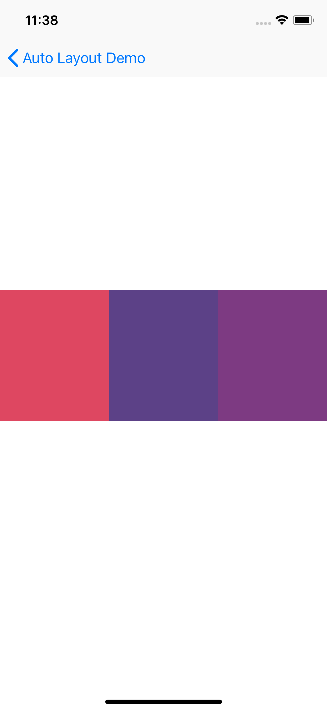
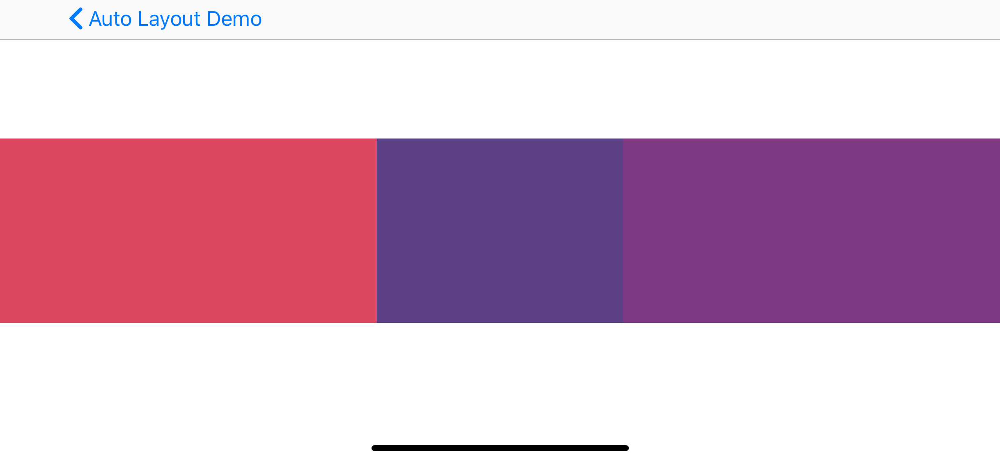
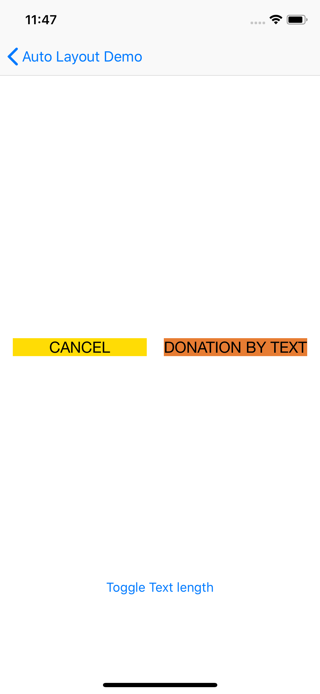
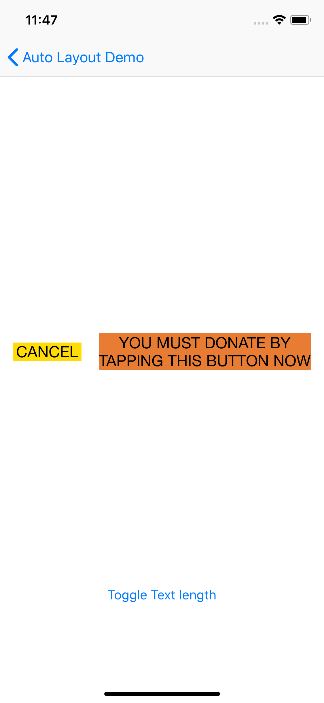
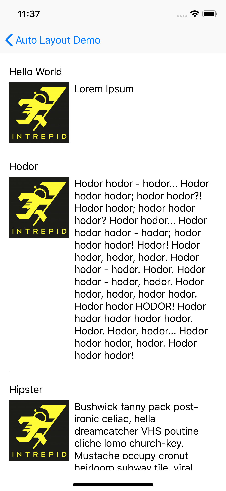

# AutoLayoutDemo
These cases are a little contrived as you could use a UIStackView to accomplish these. But it is simple so we can talk about wiring up constraints.

## Basic Horizontal Menu items
**Story:** "I want the middle view to be equal size with the others but no wider than 200 points, and the side views should be pinned to each side."
- Layout with IB first
- Then try adding constraints using code.

## Prompt Buttons
**Story:** "For _Donation By Text_ button, if there is no more space, have the text expand into multiple lines if needed." Then have the cancel button shrink up until the text.
- Layout with IB using hugging/compression

 

## TableViewCells
As of iOS9, UITableViewCells can size themselves based on constraints.

**Story:** "Show all the _mainText_ in the cells, expanding them and contracting when necessary, but always show the image at 100 x 100."
- Layout with IB
  - Use margins when needed (be sure to check iPhone X landscape views).
  - Use inequalities when needed.
  - Try aligning edges.

## Layout Anchors

**Story:** "Show all the _Squares_ in the view, with the following sizes and margins"

- Top Left:
    - Height & width: 100
    - left margin: 8
- Top Right:
    - Height & width: 40
    - top margin: 10
- Bottom Left:
    - Height & width: 70
    - bottom margin: 30
- Bottom Right:
    - Height & width: 23
    - right margin: 10

- Layout with programmatic layout anchors
- Use margins when needed (be sure to check iPhone X portrait views).

## Answers
You can use these code samples as a guide or reference if needed:

1. [answer/basic-case-ib](https://github.com/IntrepidPursuits/AutoLayoutDemo/tree/answer/basic-case-ib)
2. [answer/basic-case-programmatic](https://github.com/IntrepidPursuits/AutoLayoutDemo/tree/answer/basic-case-programmatic)
3. [answer/basic-case-inequality](https://github.com/IntrepidPursuits/AutoLayoutDemo/tree/answer/basic-case-inequality)
4. [answer/prompt-hugging-compression](https://github.com/IntrepidPursuits/AutoLayoutDemo/tree/answer/prompt-hugging-compression)
5. [answer/prompt-multiple-lines](https://github.com/IntrepidPursuits/AutoLayoutDemo/tree/answer/prompt-multiple-lines)
6. [answer/tableviewcell-layout](https://github.com/IntrepidPursuits/AutoLayoutDemo/tree/answer/tableviewcell-layout)
7. [answer/layout-anchors-programmatic](https://github.com/IntrepidPursuits/AutoLayoutDemo/tree/answer/layout-anchors-programmatic)
